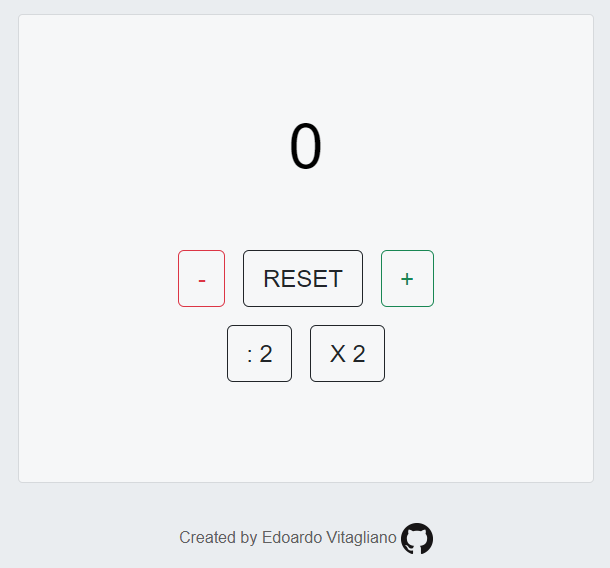

# Javascript Basic Project

This project is mainly based on Javascript created by me (Edoardo Vitagliano) for the final project of the Start2Impact Javascript Basic course.

## Introduction

This project is a simple application that works as a counter completely in javascript.

## Materials

All frameworks \ programs I used to create this project are:

- [Visual Studio Code](https://code.visualstudio.com/) , for the writing part of the code.

## Build with

- Javascript
- HTML
- CSS

## Contributing
Pull requests are welcome. For major changes, please open an issue first to discuss what you would like to change.

## License
[MIT](https://choosealicense.com/licenses/mit/)
